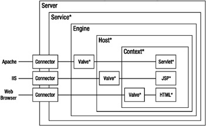

# [톰캣서버]Tomcat 내부 구조와 설정파일

## 클라이언트가 요청을 보내면 톰캣 내부에서는 어떤 일이 일어날까?


##### 톰캣 서버 내부 구조


````html
Tomcat Server안에 Service가 있고 그 서비스를 처리하는 것이 Engine(Catalina)이다.
Engine안에는 Host가 여러 개가 있을 수 있다.
Host안에는 여러 개의 Context가 있을 수 있다.
여기사 Context란 쉽게 말해 스프링프로젝트라고 생각하면 된다.
Context안에 있는 Servlet이 여러개 있는데 각 Servlet은 쉽게 Controller로 생각할 수 있다.
````

````html
클라이언트가 먼저 url을 요청하면 Thread Pool로 간다. Thread Pool은 요청을 받은 후에 만들면 늦으니까 요청을 받기 전 미리 만들어 놓는다.
그 중 요청을 처리하고 있지 않은 Thread 하나가 요청을 받게된다.
요청 프로토콜에 따라 Connector가 동일한 프로토콜을 연결해주며 보통 HTTP1.1 프로토콜이다.
프로토콜이 프로세스를 처리해서 Engline(Catalina)을 거치고 요청 받은 Host안의 Context까지 찾은 다음 해당 Servlet을 호출한다.
Dispatcher Servlet이 요청받은 Controller의 method를 찾아 호출한다.
````
  